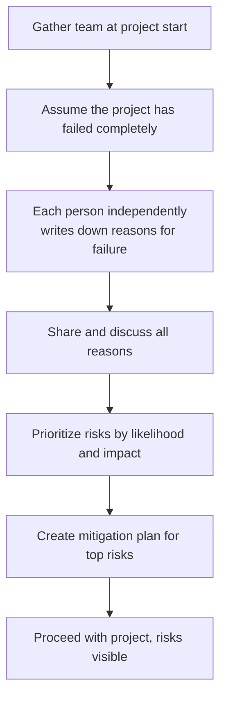
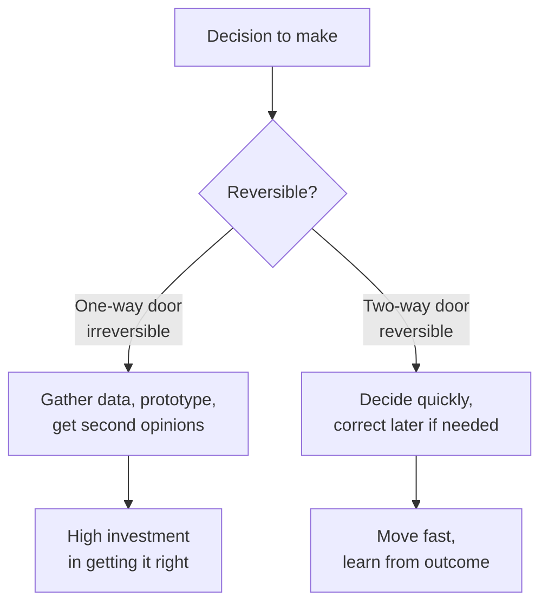

import TawkWidget from '../../../../components/TawkWidget.astro';
import UniversalContentContributors from '../../../../components/UniversalContentContributors.astro';
import InArticleAd from '../../../../components/InArticleAd.astro';
import Copyright from '../../../../components/Copyright.astro';
import BionicText from '../../../../components/BionicText.astro';
import TailwindWrapper from '../../../../components/TailwindWrapper.jsx';
import { Tabs, TabItem } from '@astrojs/starlight/components';
import { Card, CardGrid, Badge, Steps, LinkButton, FileTree } from '@astrojs/starlight/components';

<UniversalContentContributors 
  contributors={frontmatter.contributors}
/>


import CriticalThinkingEngineersComments from '../../../../components/critical-thinking-engineers/CriticalThinkingEngineersComments.astro';

Engineering is not just solving equations and writing code. It is making decisions, constantly, under uncertainty, with incomplete information, and with real consequences. Which microcontroller for this product? Which communication protocol? Build or buy? Ship now or fix that last bug? The quality of these decisions determines the success of your projects far more than the quality of any single calculation. This lesson gives you practical tools for making better decisions, and a sobering case study of what happens when decision-making goes catastrophically wrong. #DecisionMaking #Engineering #CriticalThinking

## Decision Matrices: Making Trade-offs Visible

A decision matrix forces you to make your criteria explicit, assign relative importance to each criterion, and score each option systematically. It does not make the decision for you, but it prevents you from making a decision based on whichever criterion you happened to think of last.

### Example: Choosing a Microcontroller

Suppose you are choosing between three MCUs for a battery-powered sensor node. You care about power consumption, cost, available peripherals, community support, and development tool quality.

<Steps>
1. **List your criteria.** Power consumption, unit cost, peripherals, community, tooling.
2. **Assign weights.** Power is critical (weight 5). Cost matters (weight 4). Peripherals are important (weight 3). Community is nice to have (weight 2). Tooling is a factor (weight 2).
3. **Score each option.** Rate each MCU from 1 to 5 on each criterion.
4. **Compute weighted scores.** Multiply each score by the weight and sum.
</Steps>

| Criterion | Weight | MCU A | MCU B | MCU C |
|-----------|--------|-------|-------|-------|
| Power consumption | 5 | 4 (20) | 5 (25) | 3 (15) |
| Unit cost | 4 | 3 (12) | 2 (8) | 5 (20) |
| Peripherals | 3 | 5 (15) | 4 (12) | 3 (9) |
| Community support | 2 | 5 (10) | 3 (6) | 2 (4) |
| Dev tooling | 2 | 4 (8) | 4 (8) | 3 (6) |
| **Total** | | **65** | **59** | **54** |

MCU A scores highest. But notice something important: the matrix does not just give you an answer. It shows you why. MCU B wins on power but loses on cost. MCU C wins on cost but loses on almost everything else. If your project priorities shift (say power becomes less important), you can quickly re-evaluate by adjusting the weights.

### Pitfalls of Decision Matrices

<CardGrid>
<Card title="Garbage In, Garbage Out" icon="warning">
If your scores are not grounded in data, the matrix just quantifies your biases. "I feel like MCU A has better community support" is not the same as "MCU A has 3x more Stack Overflow questions and 2x more GitHub repositories."
</Card>
<Card title="Weight Manipulation" icon="warning">
It is easy to unconsciously adjust the weights until your preferred option wins. Assign weights before you score the options. Better yet, have different people assign weights and scores.
</Card>
<Card title="Missing Criteria" icon="warning">
The matrix only evaluates criteria you include. If you forget to consider long-term availability (will this chip still be manufactured in 5 years?), the matrix will not flag the risk. Always ask: "What am I not evaluating?"
</Card>
<Card title="False Precision" icon="warning">
Scoring "community support" as 4.2 vs 3.8 implies a precision you do not have. Use coarse scales (1 to 5, or even just Low/Medium/High). The matrix is a thinking tool, not a calculator.
</Card>
</CardGrid>

### Sensitivity Analysis

After building a decision matrix, ask: "How much would the weights or scores need to change to flip the result?" If changing one weight by a single point changes the winner, the result is fragile and you should not trust it blindly. If the winner leads by a large margin regardless of reasonable weight changes, you can be more confident.

This is called sensitivity analysis, and it takes about 5 minutes. Vary each weight by one point up and down and see if the winner changes. If it does, the decision is closer than the matrix suggests, and you should look more carefully at the criteria where the options differ most.

## Trade-off Analysis: Making Costs Explicit

<InArticleAd />


```text
  Choosing Your Decision Method
  ──────────────────────────────────────────────────────────
  Stakes / Complexity          Method             Time
  ──────────────────────────── ────────────────── ─────────
  Low stakes, reversible       Decide and iterate 5 min
  Simple choice, 2-3 options   Pro/con list       15 min
  Multiple criteria, weights   Decision matrix    45 min
  High stakes, irreversible    Full analysis +    2-4 hrs
                               premortem +
                               sensitivity check
```

Every engineering decision involves trade-offs. Choosing a faster processor means higher power consumption. Choosing a cheaper material means lower strength. Using a more mature framework means less flexibility. There is no free lunch.

The discipline of trade-off analysis is simply making these costs explicit instead of pretending they do not exist.

### The Iron Triangle (and Its Extensions)

The classic project management trade-off is scope, schedule, and cost. You can have any two, but not all three. If you want more features (scope) and you want them sooner (schedule), you need more people or more money (cost). If you fix the budget and the deadline, you must cut features.

In engineering, the trade-offs are more varied:

| Choice A | Trade-off | Choice B |
|----------|-----------|----------|
| Higher precision | vs. | Faster execution |
| More features | vs. | Simpler maintenance |
| Proven technology | vs. | Better performance |
| Custom solution | vs. | Vendor dependency |
| Thorough testing | vs. | Faster release |
| Lower power | vs. | Higher cost |

### How to Do Trade-off Analysis

<Steps>
1. **Identify the decision.** What exactly are you choosing between?
2. **List what you gain with each option.** Be specific.
3. **List what you lose with each option.** Be equally specific and honest.
4. **Quantify where possible.** "Slightly more expensive" is vague. "Costs 2.40 USD more per unit at 10k volume" is actionable.
5. **Identify which trade-offs are reversible.** Can you switch MCUs later? Can you add features in v2? Reversible trade-offs are less risky.
</Steps>

## Premortems: Imagining Failure Before It Happens

<InArticleAd />


A postmortem is what you do after a project fails. A premortem is what you do before the project starts, and it is far more useful.

The technique comes from psychologist Gary Klein, and it was popularized by Daniel Kahneman. Here is how it works:



<Card title="The Premortem Process" icon="rocket">
Gather the team at the start of the project. Say: "Imagine it is six months from now and this project has failed completely. It is a disaster. Now, each of you independently write down the reasons why it failed."

Then share and discuss the reasons. You will be surprised at how many risks people identify when given explicit permission to imagine failure.
</Card>

### Why Premortems Work

Normal project planning asks: "What could go wrong?" This triggers optimism bias. People downplay risks because they want the project to succeed. A premortem flips the framing: it starts from the assumption of failure and asks people to explain it. This makes it psychologically safe to raise concerns.

### Premortem in Practice

A team starting an IoT product might produce premortem reasons like:

- "The cellular module consumed 3x more power than the datasheet claimed, and our battery life target was impossible."
- "We underestimated the time needed for regulatory certification and missed the market window."
- "The cloud backend team and the firmware team had different assumptions about the data format, and integration took two months instead of two weeks."
- "We chose a sensor that went end-of-life six months after our product launched."

Each of these is a risk you can now mitigate before the project starts.

## Checklists: The Most Underrated Engineering Tool

<InArticleAd />


Atul Gawande's book "The Checklist Manifesto" documents how simple checklists have saved lives in surgery and aviation. The idea is straightforward: for complex, high-stakes processes, do not rely on memory. Write down the steps and check them off.

### Why Smart People Need Checklists

The argument against checklists is usually: "I know what I am doing. I do not need a list." This misses the point. Checklists are not for things you do not know. They are for things you know but might forget when you are tired, stressed, or distracted.

A pilot does not use a pre-flight checklist because they do not know how to fly. They use it because the consequences of forgetting one step are catastrophic, and human memory is unreliable under pressure.

### Engineering Checklists

<Tabs>
<TabItem label="Code Review Checklist">
- Does the code handle null/empty inputs?
- Are error codes checked and handled?
- Are resources (memory, file handles, connections) properly released?
- Are magic numbers replaced with named constants?
- Are boundary conditions tested?
- Does the code match the specification?
- Are there any race conditions in concurrent code?
</TabItem>
<TabItem label="PCB Design Checklist">
- Are all power pins decoupled with appropriate capacitors?
- Are unused inputs tied to a known state?
- Are ESD protection components placed on external-facing connectors?
- Are test points accessible for debugging?
- Are mounting holes correctly placed?
- Is the ground plane continuous under sensitive signals?
- Are silkscreen labels readable and correct?
</TabItem>
<TabItem label="Deployment Checklist">
- Are all environment variables set correctly?
- Has the database migration been tested?
- Is the rollback procedure documented and tested?
- Are monitoring and alerting configured?
- Has the team been notified of the deployment window?
- Are backups current?
- Is there a verification step after deployment?
</TabItem>
</Tabs>

### Building Your Own Checklists

The best checklists are built from experience, specifically from past mistakes. Every time something goes wrong because you forgot a step, add that step to the checklist. Over time, your checklist becomes a codified version of your experience.

### Read-Do vs. Do-Confirm

Gawande identifies two types of checklists:

<Tabs>
<TabItem label="Read-Do">
You read each step, then do it, then move to the next step. This is appropriate for unfamiliar or infrequent tasks. Example: setting up a new development environment. You read the step ("install the ARM toolchain"), do it, check it off, and move on.
</TabItem>
<TabItem label="Do-Confirm">
You do the work from memory, then pause at a checkpoint and run through the checklist to confirm you did not miss anything. This is appropriate for experienced professionals doing routine tasks. Example: a PCB designer finishes the layout, then runs through the design rule checklist to catch anything they might have overlooked.
</TabItem>
</Tabs>

Most engineering checklists should be Do-Confirm. You do not want the checklist to slow down experienced engineers. You want it to catch the occasional oversight that even experienced engineers make.

### Keeping Checklists Useful

A checklist that is too long will be ignored. A checklist that is too short will miss important items. Aim for 5 to 15 items per checklist. If you need more, break it into phases (pre-design checklist, post-layout checklist, pre-manufacturing checklist).

Review your checklists periodically. Remove items that are never relevant. Add items from recent incidents. A checklist is a living document, not a stone tablet.

## Second Opinions and Code Review

<InArticleAd />


Code review is institutionalized second-opinion thinking. You wrote the code, so you are the worst person to find its bugs. You have blind spots created by the very assumptions you used to write the code. A reviewer brings fresh eyes and different assumptions.

### Why Fresh Eyes Matter

<Card title="The Curse of Knowledge" icon="information">
Once you know something, it is hard to imagine not knowing it. When you write code, you know what it is supposed to do, so you read it through the lens of your intent. You see what you meant to write, not what you actually wrote. A reviewer does not have your intent. They see what is actually on the screen.
</Card>

### Effective Code Review

Not all code reviews are equal. A rubber-stamp review ("looks good to me" after a 30-second glance) provides no value. An effective review:

- Takes enough time to understand the change.
- Checks both correctness and clarity.
- Questions things that seem unusual or overly complex.
- Looks for what is missing (error handling, edge cases, tests), not just what is present.
- Is respectful. The goal is better code, not proving the author is wrong.

## Reversible vs. Irreversible Decisions

<InArticleAd />


Jeff Bezos introduced a useful framework: classify decisions as "one-way doors" (irreversible) or "two-way doors" (reversible), and invest effort proportionally.



### One-Way Door Decisions

These are hard or impossible to undo. Examples:

- Choosing the CPU architecture for a product that will ship millions of units.
- Signing a three-year contract with a cloud provider.
- Publishing an API that external customers will build against.
- Choosing a programming language for a large codebase.

For these decisions, take your time. Gather data. Build prototypes. Get second opinions. The cost of being wrong is high.

### Two-Way Door Decisions

These are easily reversible. Examples:

- Choosing a code formatting style (you can change it later with an automated tool).
- Picking a logging library (you can swap it if the abstraction layer is clean).
- Deciding on a meeting schedule (you can change it next week).
- Trying a new testing framework on a side project.

For these decisions, move fast. The cost of being wrong is low because you can change your mind. The cost of deliberating too long is wasted time.

### The Mistake Most Organizations Make

Most organizations treat two-way door decisions like one-way doors. They hold three meetings to decide on a code formatter. They form a committee to evaluate logging libraries. They spend weeks debating choices that could be reversed in a day.

The result is slow decision-making across the board. The fix is to explicitly classify each decision as one-way or two-way, and spend proportional effort.

## Disagree and Commit

<InArticleAd />


Sometimes the team cannot reach consensus. Two reasonable people look at the same evidence and reach different conclusions. This is normal, especially for complex engineering decisions where the evidence is ambiguous.

"Disagree and commit" means: once a decision is made, everyone executes it wholeheartedly, even those who disagreed. You are allowed to voice your dissent during the decision process. But once the team decides, you do not sabotage the decision by dragging your feet or saying "I told you so" if things go wrong.

### Why This Works

- **Speed.** Waiting for consensus can paralyze a team. Some decisions have deadlines.
- **Learning.** If the team picks an approach you disagreed with, you might discover you were wrong. That is valuable.
- **Trust.** If you commit fully to a decision you disagreed with, and it works out, the team learns it can make decisions without unanimity.
- **Accountability.** If you agree to commit, the outcome is the team's responsibility, not just the decision-maker's.

### When to Escalate Instead

Disagree and commit does not mean you should silently go along with decisions you believe are dangerous or unethical. If you believe a decision will cause serious harm (safety risk, legal violation, massive financial loss), escalate. Raise your concerns to the appropriate level. This is not undermining the team. It is protecting it.

## Lessons from NASA: The Challenger Disaster

<InArticleAd />


On January 28, 1986, the Space Shuttle Challenger broke apart 73 seconds after launch, killing all seven crew members. The technical cause was well-established: an O-ring in the right solid rocket booster failed to seal properly in the cold temperatures on launch day. But the deeper cause was a failure of decision-making.

### Normalization of Deviance

Sociologist Diane Vaughan coined the term "normalization of deviance" to describe what happened at NASA. The O-rings had shown signs of damage on previous flights. Each time, the damage was noted, analyzed, and deemed acceptable. Over time, the standard for what counted as "acceptable" gradually shifted. Behavior that would have been alarming early in the program became routine.

This is not unique to NASA. It happens in every organization:

- "The build has been failing intermittently, but it always passes on retry." (Until it does not.)
- "The server occasionally runs out of memory, but restarting it fixes it." (Until you cannot restart fast enough.)
- "The power supply gets hot, but it has not failed yet." (Until it does.)

### Groupthink and Social Pressure

The engineers at Morton Thiokol (the O-ring manufacturer) recommended against launching in the cold weather. Their managers overruled them, partly because of pressure from NASA to maintain the launch schedule. The engineers had the data. The managers had the authority. Authority won.

<Card title="Lessons for Engineers" icon="information">
1. Data should drive decisions, not hierarchy.
2. When someone raises a safety concern, the burden of proof should be on those who want to proceed, not on those who want to stop.
3. Schedule pressure is never a valid reason to accept increased risk without explicit acknowledgment.
4. "We got away with it last time" is not evidence that it is safe.
</Card>

## A Personal Decision Framework

<InArticleAd />


Here is a simple checklist you can apply to any significant engineering decision:

<Steps>
1. **What am I deciding?** State the decision clearly. "We need to choose between protocol X and protocol Y for the sensor network."

2. **What are my options?** List at least three. If you can only think of two, you probably have not explored the space enough.

3. **What criteria matter?** List the factors that matter for this decision. Weight them by importance.

4. **What is the evidence for each option?** Distinguish between data, expert opinion, and speculation. Be honest about how strong the evidence is.

5. **Is this decision reversible?** If yes, decide quickly and move on. If no, invest more time.

6. **What could go wrong?** Run a quick premortem. If this decision turns out badly, what would the reason be?

7. **Who disagrees, and why?** Seek out dissenting opinions. If everyone agrees too quickly, someone is not thinking hard enough, or someone is not speaking up.

8. **What would change my mind?** Before committing, identify what evidence would make you reverse this decision. This prevents the sunk cost fallacy from locking you in later.
</Steps>

You do not need to go through all eight steps for every decision. For two-way doors, steps 1, 2, and 5 are usually enough. For one-way doors, do all eight.

## Common Decision-Making Traps

<InArticleAd />


| Trap | Description | Remedy |
|------|-------------|--------|
| Anchoring | The first number you hear dominates your thinking | Generate your own estimate before looking at others |
| Sunk cost fallacy | "We have already spent 6 months on this approach" | Ask: "If we were starting fresh, would we choose this approach?" |
| Confirmation bias | Seeking evidence that supports your preferred option | Assign someone to argue against your preferred option |
| Analysis paralysis | Analyzing endlessly without deciding | Set a deadline. For two-way doors, decide quickly |
| Availability bias | Overweighting vivid or recent examples | Use data, not anecdotes, to assess likelihood |
| Bandwagon effect | Choosing what everyone else is choosing | Ask whether the popular choice fits your specific constraints |

### The Sunk Cost Fallacy in Engineering

The sunk cost fallacy deserves special attention because it is so pervasive in engineering projects. You have spent six months and 200,000 USD on an approach that is clearly not working. The rational thing to do is evaluate your options from this point forward, ignoring what you have already spent (because you cannot get it back regardless of what you decide). But the emotional pull to "not waste" the investment is powerful.

A useful reframe: "If we were starting this project today, with everything we now know, would we choose this approach?" If the answer is no, continuing is the real waste, because you are spending future resources on a known-bad approach to justify past resources you cannot recover.

<Card title="The Concorde Fallacy" icon="information">
The Concorde supersonic airliner is the classic example. Both the British and French governments continued funding the project long after it became clear it would never be commercially viable, because neither government wanted to "waste" the billions already spent. The result was spending even more billions on an airplane that lost money on every flight. The sunk cost fallacy is sometimes called the "Concorde fallacy" for this reason.
</Card>

## Decision Speed and Reversibility in Practice

<InArticleAd />


Let us work through a few real scenarios to build intuition about how much effort to invest in different decisions.

### Scenario 1: Choosing a Wire Gauge

You need to run power to a sensor 5 meters away. The current is 200 mA. Should you use 22 AWG or 24 AWG?

This is a two-way door. If you pick the wrong gauge, you can swap it later. The cost of the wire is negligible. Spend 2 minutes checking that the voltage drop is acceptable at 200 mA over 5 meters, pick a gauge, and move on.

### Scenario 2: Choosing a Processor Family

You are starting a new product line that will be manufactured for 10 years. Should you use ARM Cortex-M, RISC-V, or a proprietary architecture?

This is a one-way door. Switching processor families later means rewriting firmware, redesigning the PCB, requalifying the hardware, and retraining the team. Spend weeks on this decision. Build prototypes. Talk to the semiconductor vendors about long-term availability commitments. Get input from the firmware team, the hardware team, and the supply chain team.

### Scenario 3: Choosing a Git Branching Strategy

Your team of five developers is starting a new project. Should you use Git Flow, trunk-based development, or something else?

This is a two-way door, but with some switching cost. You can change your branching strategy, but it requires team agreement and some adjustment time. Spend an afternoon discussing it, try one approach for a few sprints, and switch if it is not working. Do not form a committee.

### Scenario 4: Committing to a Cloud Provider

Your IoT platform needs cloud infrastructure. AWS, Azure, or GCP?

This is closer to a one-way door than most people realize. Cloud-specific APIs, services, and tooling create lock-in. The longer you build on one platform, the harder it is to switch. Spend serious time evaluating all three. Consider abstraction layers that reduce lock-in. Look at pricing models carefully, because costs at scale can differ dramatically from the free tier experience.

## Building Good Decision Habits

<InArticleAd />


Good decision-making is a skill, not a talent. Like any skill, it improves with deliberate practice.

### Keep a Decision Journal

After making a significant decision, write down:

- What you decided and why.
- What alternatives you considered.
- What evidence supported your choice.
- What risks you identified.
- What would cause you to change your mind.

Six months later, review the journal. Were you right? Were you wrong? Were the risks you identified the ones that actually materialized, or did something unexpected happen? This feedback loop is how you calibrate your decision-making over time.

### Seek Disagreement

The most dangerous decisions are the ones where everyone agrees immediately. Unanimous agreement often means the team has not thought hard enough, or that dissenting voices are being suppressed.

Actively seek out people who disagree with you. Not to argue with them, but to understand their reasoning. They might see a risk you missed. They might have information you lack. At minimum, engaging with disagreement strengthens your own reasoning by forcing you to defend it.

### Decide, Then Execute

A good decision executed vigorously is better than a perfect decision executed half-heartedly. Once you have done your due diligence, commit. Do not second-guess yourself every day. Set a review point in the future ("we will re-evaluate this choice in three months") and focus on execution until then.

The exception is when new information fundamentally changes the picture. If you chose Vendor A and then Vendor A announces they are discontinuing the product, do not wait until the three-month review. Update immediately.

## Exercises

<InArticleAd />


1. **Decision matrix.** You are choosing a communication protocol for a battery-powered sensor network: LoRa, Zigbee, or BLE Mesh. Build a decision matrix with at least five criteria and appropriate weights. Score each protocol and see which wins. Then change the weights to reflect a different priority (e.g., range becomes less important, cost becomes more important) and see how the result changes.

2. **Premortem.** Pick a project you are currently working on (or a hypothetical one). Run a premortem: write down five specific, plausible reasons the project could fail. For each reason, identify one action you could take now to reduce the risk.

3. **Reversibility assessment.** List five engineering decisions you have made recently. Classify each as a one-way door or two-way door. For the two-way doors, did you spend more time deciding than the decision warranted?

4. **Challenger case study.** Read the Rogers Commission Report (the official investigation of the Challenger disaster), specifically Chapter V on the O-ring problem. Identify three specific points where a different decision could have prevented the disaster. What decision-making process would have led to a different outcome at each point?

## Summary

<InArticleAd />


Good engineering decisions require structured thinking, not just technical knowledge. Decision matrices make trade-offs visible and prevent you from optimizing for the last criterion you thought of. Premortems harness the power of imagining failure to identify risks early. Checklists compensate for the unreliability of human memory under pressure. Code review provides the fresh eyes that catch blind spots. Classifying decisions as reversible or irreversible helps you spend effort proportionally. And the Challenger disaster reminds us that decision-making failures can have catastrophic consequences, especially when social pressure overrides technical evidence. Build these tools into your engineering practice and you will make better decisions, catch more risks, and waste less time on choices that do not matter.

<CriticalThinkingEngineersComments />


<InArticleAd />
<TawkWidget />
<Copyright />