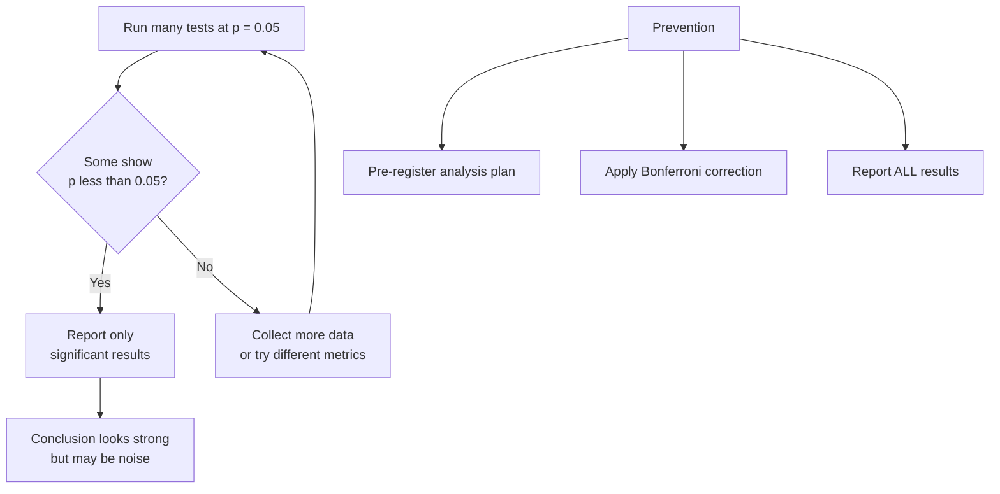

import TawkWidget from '../../../../components/TawkWidget.astro';
import UniversalContentContributors from '../../../../components/UniversalContentContributors.astro';
import InArticleAd from '../../../../components/InArticleAd.astro';
import Copyright from '../../../../components/Copyright.astro';
import BionicText from '../../../../components/BionicText.astro';
import TailwindWrapper from '../../../../components/TailwindWrapper.jsx';
import { Tabs, TabItem } from '@astrojs/starlight/components';
import { Card, CardGrid, Badge, Steps, LinkButton, FileTree } from '@astrojs/starlight/components';

<UniversalContentContributors 
  contributors={frontmatter.contributors}
/>


import CriticalThinkingEngineersComments from '../../../../components/critical-thinking-engineers/CriticalThinkingEngineersComments.astro';

Engineers use data to make decisions every day: test results, benchmark comparisons, sensor readings, failure rates. But collecting data is only half the job. Interpreting it correctly is where most mistakes happen. Inspired by Alex Reinhart's book "Statistics Done Wrong," this lesson covers the statistical errors that show up most often in engineering contexts. These are not exotic mistakes that only affect academic researchers. They are everyday errors that affect whether you ship buggy firmware, choose the wrong component, or draw false conclusions from your test bench. #Statistics #DataAnalysis #CriticalThinking

## The P-Value: What It Actually Means

The p-value is the most misunderstood number in engineering and science. Let us set the record straight.

<Card title="The Real Definition" icon="star">
A p-value is the probability of observing data at least as extreme as what you measured, assuming the null hypothesis is true. That is it. It does not tell you the probability that your hypothesis is correct. It does not tell you the probability that the result is "real." It does not tell you the size or importance of the effect.
</Card>

```text
  What a P-Value Actually Measures
  ──────────────────────────────────────────────────────────
  Assume: null hypothesis is true (no real effect)
       │
       ▼
  Run your experiment, collect data
       │
       ▼
  p-value = probability of seeing data
            THIS EXTREME or more extreme,
            if there truly is no effect
       │
       ▼
  p < 0.05 means: this result would happen
  by pure chance less than 5% of the time

  IT DOES NOT MEAN:
  ✗ "5% chance the result is random"
  ✗ "95% chance our hypothesis is correct"
  ✗ "The effect is large or important"
```

### What p = 0.05 Does NOT Mean

| Common Misinterpretation | Why It Is Wrong |
|--------------------------|----------------|
| "There is only a 5% chance the result is due to chance" | The p-value assumes chance (null hypothesis) is the explanation. It tells you how surprising the data is under that assumption, not the probability that chance is the explanation. |
| "There is a 95% chance our hypothesis is correct" | P-values say nothing about the probability of hypotheses. That requires Bayesian analysis with prior probabilities. |
| "The effect is large and important" | A tiny, practically meaningless effect can have p < 0.001 if the sample size is large enough. Statistical significance is not the same as practical significance. |
| "If p > 0.05, there is no effect" | Failure to reject the null hypothesis is not the same as confirming it. Your test might simply lack the statistical power to detect a real effect. |

### Engineering Example

You are comparing two sorting algorithms on your embedded system. You run each 10 times and find that Algorithm A averages 12.3 ms and Algorithm B averages 12.1 ms, with p = 0.03. Statistically significant! But a 0.2 ms difference on a system with 50 ms timing margins is practically irrelevant. The p-value told you the difference is probably real, but it did not tell you the difference matters.

**Rule of thumb:** Always report effect sizes alongside p-values. "Algorithm B is 0.2 ms faster (p = 0.03)" lets the reader judge both statistical and practical significance.

## P-Hacking: Torturing Data Until It Confesses

<InArticleAd />


**What it is:** Running many statistical tests, trying different subsets of data, adjusting parameters, or selectively reporting results until you find something with p < 0.05.

The following simulation shows how easy it is to find "significant" results from pure noise. We test 20 completely random hypotheses (no real effect exists) and count how many come back with p < 0.05.

```python title="p_hacking_simulation.py"
import numpy as np
from scipy import stats

np.random.seed(42)
n_hypotheses = 20
n_samples = 30  # samples per group
alpha = 0.05
false_positives = 0

print(f"Testing {n_hypotheses} random hypotheses (NO real effect)...\n")
for i in range(n_hypotheses):
    group_a = np.random.normal(loc=0, scale=1, size=n_samples)
    group_b = np.random.normal(loc=0, scale=1, size=n_samples)
    t_stat, p_val = stats.ttest_ind(group_a, group_b)
    if p_val < alpha:
        false_positives += 1
        print(f"  Hypothesis {i+1}: p = {p_val:.4f}  ** 'SIGNIFICANT' (false positive)")

print(f"\nResults: {false_positives} out of {n_hypotheses} tests were 'significant' at p < {alpha}")
print(f"Expected by chance: {n_hypotheses * alpha:.0f}")
print(f"\nLesson: test enough random things and you WILL find 'significant' results.")
print(f"This is p-hacking. The 'discoveries' are pure noise.")
```



<Tabs>
  <TabItem label="How It Happens">
    You are testing whether a new compiler optimization improves performance. You run benchmarks on 20 different code patterns. Most show no significant difference. But three patterns show p < 0.05 improvement. You report those three and conclude "the optimization significantly improves performance for computational kernels."

    The problem: if you test 20 things at the p = 0.05 level, you expect about one false positive purely by chance (20 x 0.05 = 1). Finding three "significant" results out of 20 tests is barely above the false positive rate. You might be reporting noise.
  </TabItem>
  <TabItem label="Subtle Forms">
    P-hacking is often unintentional. Common forms include:

    - **Optional stopping:** Running an experiment until you get a significant result, then stopping. "Let us collect more data" selectively when the current results are not significant.
    - **Outlier exclusion:** Removing data points that hurt your results with post-hoc justifications.
    - **Subgroup analysis:** Slicing data by different categories until a significant pattern emerges. "The optimization does not help overall, but it helps for loops with fewer than 50 iterations."
    - **Multiple metrics:** Testing many outcome measures and reporting only the one that reached significance.
  </TabItem>
  <TabItem label="How to Prevent It">
    - **Pre-register your analysis plan.** Before collecting data, write down what you will test, how many tests, and what threshold you will use for significance.
    - **Apply multiple comparison corrections.** If you run 20 tests, use Bonferroni correction (divide your significance threshold by 20) or control the false discovery rate.
    - **Report all results.** Include the tests that did not reach significance. A reader who sees "3 out of 20 patterns improved" draws a very different conclusion than one who sees "computational kernels improved."
  </TabItem>
</Tabs>

## Small Sample Sizes: The Engineering Epidemic

<InArticleAd />


This is perhaps the most common statistical error in everyday engineering: drawing strong conclusions from tiny amounts of data.

<Card title="The Core Problem" icon="warning">
You tested your firmware on 3 boards and all 3 passed. You tested your API under load and it handled all 5 test runs without errors. You benchmarked your algorithm on 4 datasets and it was faster every time. In each case, the sample size is far too small to draw reliable conclusions. With 3 boards, you have not tested enough variation in component tolerances, PCB manufacturing differences, or environmental conditions. Your 5 load test runs do not capture the variance in network conditions, database state, or garbage collection timing.
</Card>

### How Small Is Too Small?

There is no universal answer, but some guidelines for engineering contexts:

| Context | Minimum Sample Size | Why |
|---------|-------------------|-----|
| **Hardware testing** | 30+ units for basic statistics, 100+ for reliability estimates | Component tolerances, manufacturing variation |
| **Performance benchmarking** | 30+ runs minimum, with warm-up runs excluded | JIT compilation, caching effects, OS scheduling variance |
| **A/B testing (web)** | Depends on effect size; typically thousands per variant | Small effects require large samples to detect |
| **Sensor calibration** | 50+ readings per calibration point | Sensor noise, environmental variation |

### The "We Ran It 3 Times" Problem

How often will 3 tests miss a real defect? The simulation below draws from a population with a known 10% defect rate and checks how many batches of 3 tests come back clean.

```python title="small_sample_trap.py"
import numpy as np

np.random.seed(42)
n_simulations = 10000
n_tests = 3
defect_rate = 0.10

# Each simulation: draw n_tests items, each defective with probability defect_rate
results = np.random.random((n_simulations, n_tests)) < defect_rate
batches_all_pass = np.sum(~np.any(results, axis=1))

miss_pct = 100 * batches_all_pass / n_simulations
theory_pct = 100 * (1 - defect_rate) ** n_tests

print(f"Simulated {n_simulations} batches of {n_tests} tests (true defect rate = {defect_rate*100:.0f}%)\n")
print(f"Batches where ALL {n_tests} tests passed (defect hidden): {batches_all_pass} / {n_simulations}")
print(f"Simulated miss rate:   {miss_pct:.1f}%")
print(f"Theoretical miss rate: {theory_pct:.1f}%  [= (1 - {defect_rate})^{n_tests}]")
print(f"\nWith only {n_tests} tests, you miss a {defect_rate*100:.0f}% defect rate ~{theory_pct:.0f}% of the time.")
print(f"'We tested 3 boards and they all passed' is dangerously weak evidence.")
```

<Tabs>
  <TabItem label="The Scenario">
    Your team has a new firmware build. QA runs the test suite 3 times on one board. All tests pass. The build is approved for release.

    With 3 test runs, you have almost no statistical power to detect intermittent bugs. A bug that occurs 10% of the time has a 73% chance of not appearing in 3 runs (0.9 cubed = 0.729). A bug that occurs 5% of the time has an 86% chance of hiding. You have not proven reliability; you have proven almost nothing.
  </TabItem>
  <TabItem label="The Math">
    The probability of a bug hiding in n runs, given a failure probability of p per run:

    P(no failures in n runs) = (1 - p)^n

    | Failure Rate | 3 Runs | 10 Runs | 30 Runs | 100 Runs |
    |-------------|--------|---------|---------|----------|
    | 1% | 97% hide | 90% hide | 74% hide | 37% hide |
    | 5% | 86% hide | 60% hide | 21% hide | 0.6% hide |
    | 10% | 73% hide | 35% hide | 4% hide | 0.003% hide |

    Even a 10% failure rate has a 73% chance of hiding in just 3 test runs. This is why "it passed QA" can be a dangerously weak statement.
  </TabItem>
  <TabItem label="The Fix">
    Define the failure rate you need to detect and the confidence level you need, then calculate the required sample size. For a 1% failure rate at 95% confidence, you need approximately 300 test runs (ln(0.05) / ln(0.99) is approximately 299). This is not academic pedantry; it is the difference between shipping a reliable product and shipping a ticking time bomb.
  </TabItem>
</Tabs>

## Overfitting: Memorizing Noise

<InArticleAd />


**What it is:** Building a model or drawing a conclusion that fits the training data perfectly but fails on new data because it captured noise rather than the underlying pattern.

<Tabs>
  <TabItem label="In Machine Learning">
    You train a neural network to classify sensor data. On the training set, it achieves 99% accuracy. On new data, it drops to 60%. The model memorized the specific noise patterns in the training data rather than learning the general features that distinguish the classes. This is the classic overfitting problem.
  </TabItem>
  <TabItem label="In Engineering Analysis">
    Overfitting is not limited to ML. You measure system performance under 5 different configurations and find a complex relationship: "performance peaks at 3.7 GHz clock, with 4 threads, and 16 KB L1 cache, and the interaction between clock and thread count follows a cubic polynomial." With 5 data points and a complex model, you are fitting noise. The "relationship" will not hold for the 6th configuration.
  </TabItem>
  <TabItem label="How to Detect and Prevent">
    - **Hold out test data.** Never evaluate your model or conclusion on the same data used to build it.
    - **Use cross-validation.** Split your data into multiple folds and test on each fold in turn.
    - **Prefer simpler models.** A linear relationship that holds across new data is more useful than a complex polynomial that only fits the training set.
    - **Be suspicious of perfect fits.** If your model explains 100% of the variance, it is almost certainly overfitting.
  </TabItem>
</Tabs>

## Confounding Variables: Correlation Is Not Causation

<InArticleAd />


**What it is:** A confounding variable is a third factor that influences both the independent and dependent variables, creating a spurious correlation.

<Card title="The Classic Example" icon="star">
Ice cream sales and drowning deaths are strongly correlated. Eating ice cream does not cause drowning. Both are caused by a confounding variable: hot weather. People swim more in hot weather (more drownings) and buy more ice cream in hot weather. The correlation between ice cream and drowning is real, but the causal relationship is not.
</Card>

### Engineering Confounds

| Observed Correlation | Apparent Conclusion | Confounding Variable |
|---------------------|---------------------|---------------------|
| Teams that use language X ship faster | Language X makes teams faster | Teams that choose language X tend to be more experienced |
| Projects with more code reviews have fewer bugs | Code reviews prevent bugs | Both are caused by a strong engineering culture |
| Servers with more RAM crash less often | RAM prevents crashes | Servers with more RAM are newer and have fewer hardware issues |
| Engineers who attend conferences produce more patents | Conferences inspire innovation | Productive engineers are more likely to be sent to conferences |

### How to Counter Confounding

<Steps>
1. **Ask "what else changed?"** Whenever you observe a correlation, brainstorm what other variables could explain it.

2. **Control for confounds.** If you want to test whether a new compiler flag improves performance, change only the flag. Same hardware, same code, same test inputs, same time of day (to control for thermal throttling).

3. **Use randomized controlled experiments when possible.** Randomly assigning test conditions neutralizes confounds you have not even thought of.

4. **Be humble about observational data.** Most engineering data is observational (you did not randomly assign teams to programming languages). Observational data can suggest hypotheses but rarely proves causation.
</Steps>

## Base Rate Neglect

<InArticleAd />


**What it is:** Ignoring the base rate (the overall probability of an event) when evaluating specific evidence.

<Tabs>
  <TabItem label="The Classic Puzzle">
    A disease affects 1 in 10,000 people. A test for the disease is 99% accurate (99% true positive rate, 1% false positive rate). You test positive. What is the probability you actually have the disease?

    Most people say 99%. The correct answer is about 1%. Here is why: in a population of 10,000, about 1 person has the disease and 9,999 do not. The test correctly identifies the 1 sick person (99% sensitivity). But it also falsely flags about 100 healthy people (1% of 9,999). So out of 101 positive results, only 1 is a true positive. Your probability of actually having the disease is 1/101, roughly 1%.
  </TabItem>
  <TabItem label="In Engineering">
    Your automated test suite flags a build as "potentially buggy" based on static analysis. The static analysis tool has a 90% true positive rate and a 5% false positive rate. Sounds great. But if only 2% of builds actually contain bugs, most flagged builds will be false positives. Out of 1000 builds: 20 have bugs (18 correctly flagged), 980 are clean (49 falsely flagged). Of the 67 flagged builds, only 18 (27%) actually have bugs.

    This is why high false positive rates in CI tools cause "alert fatigue." The base rate of actual problems is low, so even a good detector produces mostly noise.
  </TabItem>
  <TabItem label="How to Counter">
    Always consider the base rate before interpreting test results. Ask: "How common is this event in the first place?" Then use Bayes' theorem (or just the reasoning above) to calculate the actual probability given a positive test result.
  </TabItem>
</Tabs>

## Multiple Comparisons Problem

<InArticleAd />


**What it is:** When you test many hypotheses simultaneously, the chance of at least one false positive increases dramatically.

<Card title="The Jelly Bean Study" icon="warning">
A famous xkcd comic illustrates this perfectly. Scientists test whether jelly beans cause acne. They test 20 different colors. At the p = 0.05 level, they expect 1 false positive out of 20 tests. Sure enough, green jelly beans show p = 0.04. The headline reads: "Green Jelly Beans Linked to Acne (p < 0.05)." The full context (19 other colors showed nothing) is omitted. This is the multiple comparisons problem.
</Card>

### In Engineering

You are optimizing firmware performance and test 15 different compiler flags. Using p = 0.05 as your threshold, you expect about 0.75 false positives by chance. If you find one flag with p = 0.04, it is more likely noise than signal.

**The Bonferroni correction:** Divide your significance threshold by the number of tests. For 15 tests at p = 0.05, require p < 0.05/15 = 0.0033 for any individual test to be considered significant. This is conservative but prevents false discoveries.

**False Discovery Rate (FDR) control:** A less conservative approach that controls the expected proportion of false discoveries among all discoveries. The Benjamini-Hochberg procedure is the most common method.

## Practical Checklist for Engineering Data

<InArticleAd />


Before drawing conclusions from data, run through this checklist:

<Steps>
1. **Sample size.** Is it large enough to detect the effect you care about? Can you calculate the minimum sample size needed?

2. **Effect size.** Even if statistically significant, is the effect practically meaningful for your application?

3. **Multiple comparisons.** Did you test multiple hypotheses? Did you correct for it?

4. **Confounding variables.** What else changed between your test conditions? Could a third variable explain the correlation?

5. **Selection bias.** Is your sample representative, or are you only looking at cases that survived some filter?

6. **Overfitting.** Are you testing your conclusion on the same data you used to generate it?

7. **Base rate.** How common is the event you are detecting? Could most "positive" detections be false positives?

8. **Reproducibility.** If someone else ran the same experiment, would they get the same result? Have you tried?
</Steps>

## Exercises

<InArticleAd />


### Exercise 1: P-Value Interpretation

A colleague reports: "We compared the latency of Framework A vs Framework B. Framework A had a mean latency of 45 ms and Framework B had 43 ms, with p = 0.02. Framework B is significantly faster." Write a response that addresses what this result does and does not tell you. Consider effect size, sample size, and practical significance.

### Exercise 2: Sample Size Calculator

Your team needs to verify that a firmware bug with a 2% occurrence rate is fixed. How many test runs do you need to be 95% confident that the bug is gone? (Hint: use the formula n = ln(1 - confidence) / ln(1 - failure_rate), so n = ln(0.05) / ln(0.98), which gives approximately 149.)

### Exercise 3: Confound Spotter

Your company adopted a new project management tool six months ago. Since then, on-time delivery improved by 20%. Your manager credits the tool. List at least three confounding variables that could explain the improvement without the tool being the cause.

### Exercise 4: Base Rate Calculation

Your CI pipeline uses a static analysis tool with a 95% true positive rate and 3% false positive rate. If 5% of commits introduce bugs, what percentage of flagged commits actually contain bugs? Work through the calculation step by step.

### Exercise 5: Multiple Comparisons Audit

Review a recent technical report or paper that tests multiple hypotheses. Did the author apply any multiple comparison correction? If not, how many of the "significant" results might be false positives?

## What Comes Next

<InArticleAd />


In [Lesson 5: How to Lie with Charts and Data](./lying-with-charts-data), we move from numerical statistics to visual presentation. You will learn how charts can mislead through truncated axes, cherry-picked time windows, deceptive scales, and visual tricks that make data say whatever the presenter wants it to say.

<CriticalThinkingEngineersComments />


<InArticleAd />
<TawkWidget />
<Copyright />