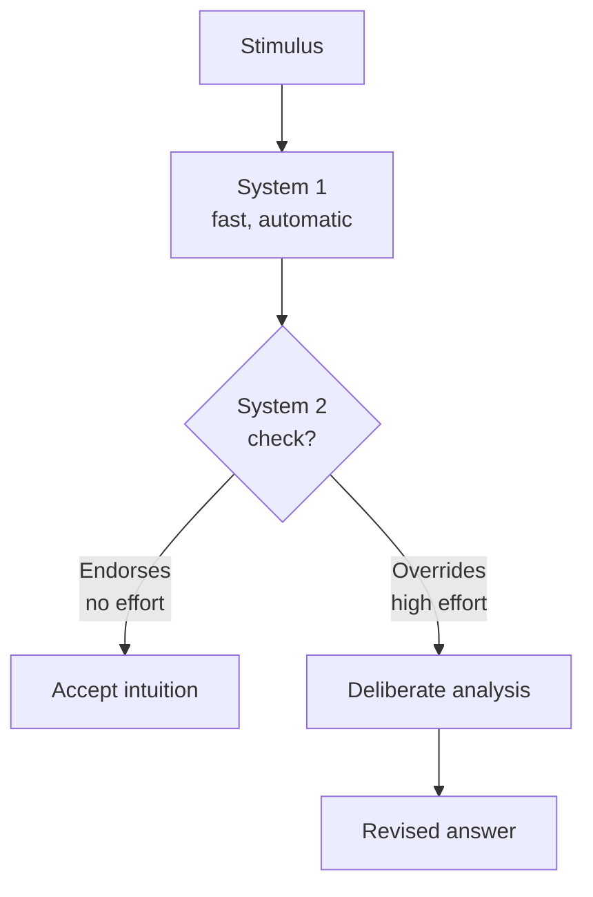

import TawkWidget from '../../../../components/TawkWidget.astro';
import UniversalContentContributors from '../../../../components/UniversalContentContributors.astro';
import InArticleAd from '../../../../components/InArticleAd.astro';
import Copyright from '../../../../components/Copyright.astro';
import BionicText from '../../../../components/BionicText.astro';
import TailwindWrapper from '../../../../components/TailwindWrapper.jsx';
import { Tabs, TabItem } from '@astrojs/starlight/components';
import { Card, CardGrid, Badge, Steps, LinkButton, FileTree } from '@astrojs/starlight/components';

<UniversalContentContributors 
  contributors={frontmatter.contributors}
/>


import PodcastEmbed from '../../../../components/PodcastEmbed.astro';

import CriticalThinkingEngineersComments from '../../../../components/critical-thinking-engineers/CriticalThinkingEngineersComments.astro';

Your brain is not a single processor. It runs two fundamentally different modes of operation, and the interplay between them shapes every technical decision you make. Daniel Kahneman's Nobel Prize-winning research revealed that most of what we think of as "reasoning" is actually rapid pattern matching that happens before conscious thought even begins. For engineers, understanding this dual-process architecture is the first step toward catching your own thinking errors before they become design errors. #CriticalThinking #SystemThinking #EngineeringMindset

<PodcastEmbed src="https://open.spotify.com/episode/5zYy6KKWhaKklopfVrniVG?si=CbNSLRzvRvqGZ_NMmd3Etg" />

## Two Systems, One Brain

Kahneman describes two modes of thinking that operate in every human mind. He called them System 1 and System 2, not because they are separate brain regions, but because they represent two fundamentally different styles of processing information.

<CardGrid>
  <Card title="System 1: Fast Thinking" icon="star">
    Automatic, effortless, and always running. System 1 recognizes patterns, generates intuitions, makes snap judgments, and produces emotional reactions. It is the system that lets an experienced engineer glance at a schematic and say "that pull-up resistor value is wrong" without consciously calculating anything. It operates on heuristics, mental shortcuts built from experience.
  </Card>

  <Card title="System 2: Slow Thinking" icon="setting">
    Deliberate, effortful, and easily exhausted. System 2 handles logical reasoning, complex calculations, careful comparison of alternatives, and anything that requires focused attention. It is the system you engage when you sit down with a datasheet and methodically verify timing constraints. It requires concentration and drains mental energy.
  </Card>
</CardGrid>

```text
  Two Modes of Thinking
  ──────────────────────────────────────────────────────────
  SYSTEM 1 (Fast)                SYSTEM 2 (Slow)
  ──────────────────────────     ──────────────────────────
  Automatic, always running      Deliberate, needs focus
  Recognizes patterns instantly  Analyzes step by step
  Emotional, intuitive           Logical, careful reasoning
  Low effort, low energy cost    High effort, drains energy

  TRUST IT WHEN:                 USE IT WHEN:
  Familiar domain, deep          Unfamiliar problem,
  expertise, quick call needed   high stakes, complex tradeoffs

  IT FAILS WHEN:                 IT'S HARD BECAUSE:
  Unfamiliar domains,            Requires concentration,
  anchoring, availability bias   we default to System 1
```



The crucial insight is this: System 1 runs first, always. It generates an answer, a feeling, an intuition, and then System 2 either endorses it (which takes no effort) or overrides it (which takes significant effort). Most of the time, System 2 is lazy. It accepts what System 1 offers without checking.

### A Quick Self-Test

Consider this problem before reading further:

> A microcontroller board and a sensor module together cost 11 USD. The board costs 10 USD more than the sensor. How much does the sensor cost?

If your immediate answer was 1 USD, that was System 1 talking. Check: if the sensor costs 1 USD, the board costs "10 more" = 11 USD, and the total would be 12 USD, not 11. That breaks the first constraint. The correct answer: let S = sensor price, then S + (S + 10) = 11, so 2S = 1, meaning S = 0.50 USD. The board costs 10.50 USD. Total: 10.50 + 0.50 = 11 USD, and the difference is exactly 10 USD. Most people, including engineers, get this wrong on first instinct because System 1 substitutes the easier problem ("11 minus 10 equals 1") for the actual algebraic constraint ("costs 10 more than" is not the same as "costs 10").

## When System 1 Helps Engineers

<InArticleAd />


System 1 is not the enemy. For experienced engineers, it is often the most valuable tool in the toolbox. Years of practice build pattern libraries that System 1 can access instantly.

<Card title="Expert Intuition Is Real" icon="approve-check">
When a senior embedded developer says "that looks like a stack overflow" after glancing at crash symptoms for two seconds, that is System 1 pattern matching against hundreds of previous debugging sessions. This intuition is genuine expertise, not a guess. Kahneman himself acknowledges that expert intuition, built through prolonged practice in a regular environment with rapid feedback, can be remarkably accurate.
</Card>

### Where System 1 Shines

| Situation | How System 1 Helps |
|-----------|-------------------|
| **Debugging familiar systems** | Pattern matching against past bugs gets you to the root cause faster than systematic analysis |
| **Code review** | Experienced reviewers "feel" when something is wrong before they can articulate why |
| **Schematic review** | Missing decoupling caps, wrong pull-up values, and incorrect pinouts jump out at experienced designers |
| **Safety checks** | "Something feels off about this test setup" is often System 1 detecting a hazard pattern |
| **Time-critical decisions** | When a production line is down, fast pattern matching beats slow analysis |

The key condition is that System 1 intuition is reliable only when you have extensive experience in a domain with clear, rapid feedback. A developer who has debugged hundreds of memory corruption issues has reliable intuition about memory corruption. That same developer's intuition about, say, antenna design (a domain where they have no experience) is worthless.

## When System 1 Fails: The Dangerous Heuristics

<InArticleAd />


System 1 uses shortcuts called heuristics. They work well in many situations but produce systematic errors in others. Here are the ones that most commonly trip up engineers.

### Anchoring

The first number you encounter disproportionately influences your subsequent estimates, even when that number is irrelevant.

<Tabs>
  <TabItem label="Engineering Example">
    Your team lead says: "I think this firmware rewrite will take about 2 weeks." Now everyone on the team anchors to that estimate. Even if your independent analysis suggests 6 weeks, you will feel pressure to adjust downward toward the anchor. Studies show that arbitrary anchors (even random numbers) shift estimates by 20-40%.

    This is why estimation poker works: everyone reveals their estimate simultaneously, preventing the most senior person from anchoring the group.
  </TabItem>
  <TabItem label="Everyday Example">
    A car dealership shows you the "original price" of 35,000 USD before offering a "discount" to 28,000 USD. The 35,000 anchor makes 28,000 feel like a bargain, even if the car's market value is 25,000 USD.
  </TabItem>
  <TabItem label="How to Counter It">
    Generate your own estimate before hearing anyone else's. In team settings, use simultaneous reveal techniques (planning poker, anonymous polling). When you notice an anchor, explicitly ask yourself: "If I had not heard that number, what would I estimate from scratch?"
  </TabItem>
</Tabs>

### Availability Heuristic

You judge the probability of an event by how easily examples come to mind, not by actual frequency.

<Tabs>
  <TabItem label="Engineering Example">
    Last month, your team spent three days tracking down a race condition in an RTOS task. Now, every time something behaves intermittently, your first hypothesis is "race condition." System 1 is serving up the most recent, most vivid debugging memory. But the actual cause might be a loose connector, a marginal power supply, or an interrupt priority issue. You are overweighting one failure mode because it is fresh in your memory.
  </TabItem>
  <TabItem label="Everyday Example">
    After seeing news coverage of a plane crash, people overestimate the danger of flying relative to driving, even though driving is statistically far more dangerous per mile traveled. Dramatic, memorable events feel more likely than they are.
  </TabItem>
  <TabItem label="How to Counter It">
    When you catch yourself jumping to a hypothesis, ask: "Am I choosing this because it is the most likely cause, or because it is the most memorable one?" Keep a log of root causes in your projects. Over time, the data will correct your availability bias.
  </TabItem>
</Tabs>

### Substitution

When faced with a hard question, System 1 silently replaces it with an easier question and answers that instead.

<Tabs>
  <TabItem label="Engineering Example">
    **Hard question:** "Is this software architecture maintainable over the next five years?"

    **Substituted question:** "Does this architecture feel clean and elegant right now?"

    System 1 swaps a difficult prediction (long-term maintainability under changing requirements) for an easy judgment (current aesthetic impression). An architecture can look clean today and become a nightmare when requirements change, or look messy today but prove remarkably adaptable.
  </TabItem>
  <TabItem label="Everyday Example">
    **Hard question:** "How happy are you with your life overall?"

    **Substituted question:** "What is my mood right now?"

    Kahneman found that people's answers to life satisfaction questions are heavily influenced by trivially manipulable factors like the weather or finding a coin on the ground moments before being asked.
  </TabItem>
  <TabItem label="How to Counter It">
    When making important decisions, write down the actual question you are trying to answer. Then check whether the evidence you are considering actually addresses that question or a simpler substitute. If you notice you are answering "do I like this?" instead of "will this work?", slow down and engage System 2.
  </TabItem>
</Tabs>

## The WYSIATI Problem

<InArticleAd />


Kahneman coined the phrase "What You See Is All There Is" (WYSIATI) to describe System 1's most dangerous tendency: it builds the best story it can from whatever information is available and never considers what information might be missing.

<Card title="WYSIATI in Engineering" icon="warning">
A hardware engineer reviews a sensor datasheet that shows excellent accuracy specs at 25 degrees Celsius. System 1 builds a confident story: "This sensor is accurate." But the datasheet did not show performance at -20 or +85 degrees, which are the actual operating conditions. System 1 never noticed the missing data because it never asks "what am I not seeing?"
</Card>

### WYSIATI Shows Up Everywhere

- **Bug reports:** You read a user's description of the problem and immediately form a hypothesis. But the user only described what they noticed, not what actually happened. Missing context (what OS version, what sequence of actions, what other software was running) gets ignored by System 1.

- **Project planning:** You estimate based on the requirements you know about. System 1 does not add time for requirements that have not been discovered yet, even though unknown requirements always emerge.

- **Hiring decisions:** You interview a candidate for 45 minutes and feel confident you know whether they will perform well. But you are building a story from a tiny sample of their behavior in an artificial setting.

### The Counter: A Pre-mortem

Before committing to a decision, run a pre-mortem. Imagine it is six months from now and the decision turned out badly. Ask: "What went wrong?" This forces System 2 to generate the missing information that System 1 ignored.

## Cognitive Ease and Engineering Decisions

<InArticleAd />


System 1 is influenced by cognitive ease: how fluently information is processed. Ideas that are presented clearly, repeated often, or primed by recent experience feel more true, regardless of their actual validity.

### How Cognitive Ease Affects Engineers

| Factor | Effect on Judgment |
|--------|-------------------|
| **Familiarity** | Frameworks and tools you have used before feel like better choices, even when unfamiliar alternatives are objectively superior for the task |
| **Presentation quality** | A beautifully formatted proposal feels more credible than a messy one with the same content |
| **Repetition** | "Everyone knows you should use RTOS for real-time systems" repeated enough times feels true, even for applications where a bare-metal approach is simpler and more appropriate |
| **Priming** | If you just read an article about security vulnerabilities, you will overweight security concerns in your next design review |

This does not mean well-presented ideas are wrong. It means that presentation quality is not evidence of technical merit, and your brain conflates the two.

## Practical Framework: When to Trust Your Gut

<InArticleAd />


Not all intuition is created equal. Use this checklist to decide whether to trust System 1 or override it with System 2.

<Card title="Trust System 1 When..." icon="approve-check">
- You have deep experience in this specific domain (not a related one)
- The environment provides clear, rapid feedback (you find out quickly if you are wrong)
- The situation matches patterns you have seen many times before
- The stakes are low enough to recover from a wrong call
- Time pressure makes deliberate analysis impractical
</Card>

<Card title="Override with System 2 When..." icon="warning">
- You are in an unfamiliar domain or facing a novel problem
- The decision has long-term consequences that are hard to reverse
- You notice strong emotional reactions driving the decision
- Multiple people on the team have different intuitions
- The problem involves probabilities, statistics, or large numbers
- You catch yourself saying "obviously" or "clearly" about something complex
</Card>

### A Decision Journal

One of the most effective debiasing tools is a decision journal. When you make a significant technical decision, write down:

<Steps>
1. **The decision and the alternatives you considered.** This forces System 2 to engage.

2. **Your confidence level.** "I am 80% sure this is the right architecture" gives you something to calibrate against later.

3. **The key assumptions.** What must be true for this decision to work out?

4. **What would change your mind.** Pre-committing to disconfirming evidence prevents post-hoc rationalization.

5. **Review quarterly.** Compare your predictions to outcomes. Over time, you will learn where your intuition is calibrated and where it is systematically off.
</Steps>

## Exercises

<InArticleAd />


These exercises help you recognize System 1 and System 2 in your daily work.

### Exercise 1: Decision Audit

Think about the last three significant technical decisions you made (choosing a library, picking a design approach, estimating a timeline). For each one:
- Did you use System 1 (gut feeling, quick judgment) or System 2 (deliberate analysis)?
- If System 1, was it based on genuine domain experience with feedback, or was it a heuristic shortcut?
- Would the outcome have been different if you had used the other system?

### Exercise 2: Anchoring Awareness

For one week, notice every time you hear a number before forming your own estimate. In meetings, ask yourself: "Would I estimate the same thing if I had not heard that number first?" Try generating your own estimates before looking at existing ones.

### Exercise 3: Availability Check

The next time you jump to a debugging hypothesis, pause and ask: "Am I choosing this because it is statistically the most likely cause, or because it is the most memorable one?" Write down three alternative hypotheses before investigating your first instinct.

### Exercise 4: WYSIATI Drill

Pick a current project decision and write down everything you know about the problem. Then write a second list: "What information am I missing that could change my conclusion?" Challenge yourself to list at least five unknowns.

### Exercise 5: Substitution Spotter

In your next design review or architecture discussion, listen for moments where the team answers an easy question instead of the hard one. Common substitutions:
- "Do we like this approach?" instead of "Will this approach scale under realistic load?"
- "Has this technology worked before?" instead of "Does this technology fit our specific constraints?"
- "Is this developer confident?" instead of "Is this estimate based on evidence?"

## Key Takeaways

<InArticleAd />


<CardGrid>
  <Card title="Two Systems" icon="star">
    Your brain runs System 1 (fast, automatic, pattern-based) and System 2 (slow, deliberate, logical). System 1 always fires first, and System 2 is lazy about checking its work.
  </Card>

  <Card title="Expert Intuition Is Earned" icon="approve-check">
    System 1 intuition is trustworthy only when built from extensive experience in a domain with clear, rapid feedback. Outside that domain, it is just a guess wearing a costume.
  </Card>

  <Card title="Heuristics Have Costs" icon="warning">
    Anchoring, availability, and substitution are not occasional glitches. They are default operating modes that affect every estimate, every diagnosis, and every decision you make.
  </Card>

  <Card title="Awareness Is the First Defense" icon="setting">
    You cannot eliminate System 1 biases, but you can learn to recognize the situations where they are most likely to mislead you and deliberately engage System 2 in those moments.
  </Card>
</CardGrid>

## What Comes Next

<InArticleAd />


In [Lesson 2: Logical Fallacies in Technical Arguments](./logical-fallacies-arguments), we move from internal thinking errors to errors in argumentation. You will learn to recognize the most common logical fallacies in code reviews, design meetings, and technical discussions, and how to respond to them constructively.

<CriticalThinkingEngineersComments />


<InArticleAd />
<TawkWidget />
<Copyright />